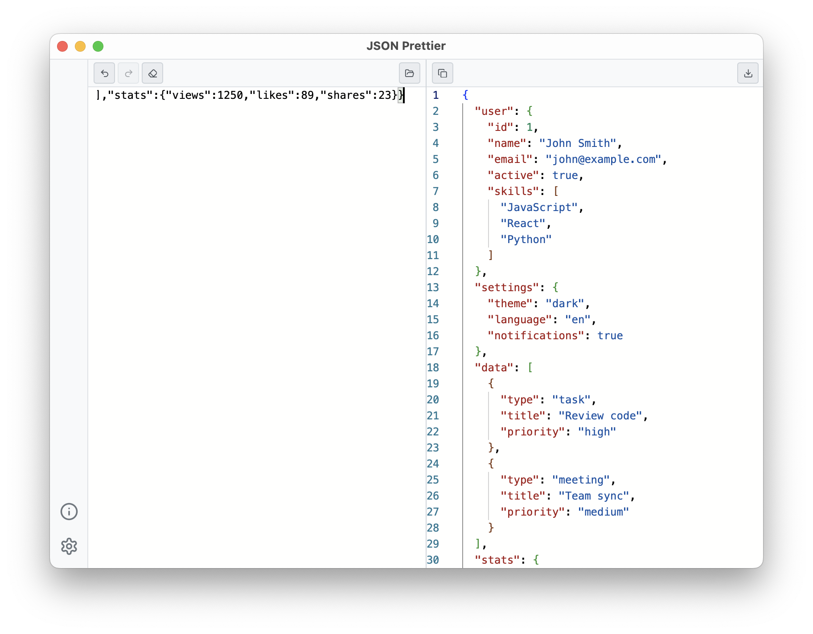

# JSON Prettier

  
  
  
  

---

  <table>
    <tr>
      <td width="33%" align="center">
        
         
        <strong>Main Interface</strong>
      </td>
      <td width="33%" align="center">
        
         
        <strong>Dark Theme</strong>
      </td>
      <td width="33%" align="center">
        
         
        <strong>Settings Panel</strong>
      </td>
    </tr>
  </table>

## 📥 Download

  <table>
    <tr>
      <td align="center" width="33%">
        
         
        <strong>macOS</strong>
         
        <a href="https://github.com/rebase/json-prettier/releases/latest/download/JSON.Prettier_0.1.0_aarch64.dmg">Apple Silicon (M1/M2)</a>
         
        <a href="https://github.com/rebase/json-prettier/releases/latest/download/JSON.Prettier_0.1.0_x64.dmg">Intel</a>
      </td>
      <td align="center" width="33%">
        
         
        <strong>Windows</strong>
         
        <a href="https://github.com/rebase/json-prettier/releases/latest/download/JSON.Prettier_0.1.0_x64-setup.exe">Setup (.exe)</a>
         
        <a href="https://github.com/rebase/json-prettier/releases/latest/download/JSON.Prettier_0.1.0_x64.msi">MSI Installer</a>
      </td>
      <td align="center" width="33%">
        
         
        <strong>Linux</strong>
         
        <a href="https://github.com/rebase/json-prettier/releases/latest/download/json-prettier_0.1.0_amd64.AppImage">AppImage</a>
         
        <a href="https://github.com/rebase/json-prettier/releases/latest/download/json-prettier_0.1.0_amd64.deb">Debian (.deb)</a>
      </td>
    </tr>
  </table>

> **macOS Users**: You may see an "untrusted developer" warning on first launch.
> Right-click the app and select "Open" to bypass this. See our [Installation Guide](INSTALLATION.md) for details.

---

## 📝 What is JSON Prettier?

JSON Prettier is a simple desktop app that makes messy JSON data look clean and organized. Whether you're a developer, data analyst, or just someone who works with JSON files, this app will help you format and read JSON data easily.

## ✨ Features

- 📂 **Open JSON files** - Load JSON from your computer
- 💾 **Save formatted JSON** - Export cleaned up data
- 🔄 **Auto-save settings** - Remembers your preferences
- 🌙 **Dark/Light themes** - Choose your preferred look
- 📋 **Copy/Paste support** - Quick text operations
- 🎨 **Syntax highlighting** - Easy to read colored JSON
- ⚡ **Fast formatting** - Instant JSON beautification

## 🐛 Something Not Working?

Found a problem? Let us know! Go to our [Issues page](https://github.com/rebase/json-prettier/issues) and tell us:

- What computer you're using (Mac, Windows, Linux)
- What version of the app you have
- What you were trying to do
- What happened vs what you expected
- A screenshot if possible

## 🛠️ For Developers

Want to contribute or build from source? Check out our [Development Guide](DEVELOPMENT.md)

  ⭐ If you find this project useful, please give it a star!

